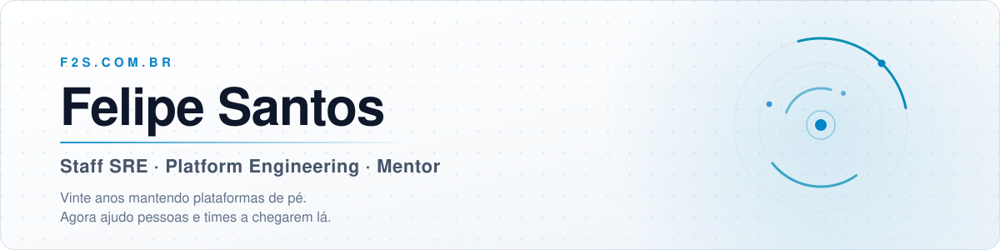

  <picture>
    <source media="(prefers-color-scheme: dark)" srcset="assets/banner-dark.svg">
    <source media="(prefers-color-scheme: light)" srcset="assets/banner-light.svg">
    
  </picture>

  
  
  
  

---

### Quem sou

Comecei em 2006, no suporte técnico, cuidando de servidor e rede. De lá pra cá acompanhei de perto cada virada da operação — virtualização, nuvem, containers, automação e a cultura de confiabilidade que hoje chamamos de SRE.

Ajudei empresas de **fintech, mercado financeiro, saúde, logística, indústria e mídia** a criar áreas de SRE e DevOps do zero, amadurecer plataformas Kubernetes em alta escala e construir developer portals internos. A maior parte dessa estrada foi como consultor independente, com passagens também como CLT em times internos.

Hoje sigo como **Staff SRE** pela F2S e divido o que aprendi em **mentorias, aulas e livros**.

<table align="center" width="100%">
  <tr>
    <td align="center" width="25%"><h2>20</h2><b>anos em tecnologia</b> do suporte ao Staff SRE</td>
    <td align="center" width="25%"><h2>4</h2><b>áreas de SRE/DevOps</b> criadas do zero</td>
    <td align="center" width="25%"><h2>5</h2><b>developer portals</b> internos com Backstage</td>
    <td align="center" width="25%"><h2>3</h2><b>livros técnicos</b> líder técnico e coautor</td>
  </tr>
</table>

---

### O que eu faço

<table>
  <tr>
    <td width="33%" valign="top">
      <h4>🧭 Mentoria 1:1</h4>
      Plano de carreira, revisão de arquitetura, preparação para entrevistas e decisões técnicas do seu dia a dia — com acompanhamento entre as sessões.
    </td>
    <td width="33%" valign="top">
      <h4>👥 Trilha guiada em turma</h4>
      Um grupo pequeno percorre o caminho de DevOps a SRE: encontros ao vivo quinzenais, projetos hands-on e revisão coletiva.
    </td>
    <td width="33%" valign="top">
      <h4>🏗️ Plataforma &amp; Confiabilidade</h4>
      Criação da área de SRE do zero, developer portal com Backstage, Kubernetes em escala, GitOps, observabilidade e SLOs.
    </td>
  </tr>
</table>

> **Boa mentoria não cria dependência.** Meu papel é te dar o mapa, revisar o caminho ao seu lado e sair de cena quando você já anda com as próprias pernas.

---

### Stack

**Cloud** &nbsp;&nbsp;   

**Plataforma & Entrega** &nbsp;&nbsp;      

**IaC & Automação** &nbsp;&nbsp;     

**Observabilidade & Confiabilidade** &nbsp;&nbsp;       

---

### Livros

Não escrevi só capítulos: **defini a ementa, aprovei o conteúdo e coordenei o time de liderança** ao longo da produção. Três obras publicadas no Brasil, nascidas da Jornada Colaborativa — comunidade que produz livros técnicos em coautoria e doa **100% dos royalties** para instituições de caridade. Trabalho voluntário do começo ao fim.

<table>
  <tr>
    <td align="center" width="33%">
      <h4>Jornada Cloud Native</h4>
      Líder técnico &amp; coautor
    </td>
    <td align="center" width="33%">
      <h4>Jornada Kubernetes</h4>
      Líder técnico &amp; coautor
    </td>
    <td align="center" width="33%">
      <h4>Jornada da Observabilidade</h4>
      Líder técnico &amp; coautor
    </td>
  </tr>
</table>

---

### Ensino

| Onde | O quê |
| --- | --- |
| **Instrutor convidado — Alura** | Cursos de **Kubernetes**, **GitHub** e **GitOps**, com foco prático em plataforma e entrega contínua |
| **Professor convidado — pós-graduação UniCarioca** | Disciplina de **arquitetura cloud-native na AWS**: soluções, CI/CD, containers, observabilidade e SLOs |

Também sou ativo na comunidade: palestro em meetups e eventos de tecnologia por todo o Brasil.

---

### Onde estive

  <code>Itaú · via Zup</code> &nbsp; <code>Getnet</code> &nbsp; <code>FCamara</code> &nbsp; <code>Atlas</code> &nbsp; <code>Axenya</code> &nbsp; <code>Southsystem</code> &nbsp; <code>Portobello</code> &nbsp; <code>NTConsult</code>

---

### Vamos conversar

Seja para evoluir na sua carreira, fortalecer o time da sua empresa ou só trocar ideia sobre plataforma e confiabilidade — me conta onde você está hoje e aonde quer chegar.

E se você está **desempregado ou em transição de carreira**, eu abro sessões de **mentoria gratuita** periodicamente. Chama.

  
  
  
  

  📍 Palhoça/SC · Brasil &nbsp;·&nbsp; F2S Consultoria &nbsp;·&nbsp; <a href="https://f2s.com.br">f2s.com.br</a>

